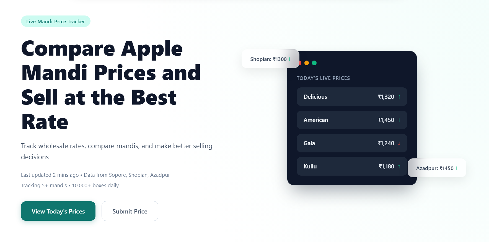
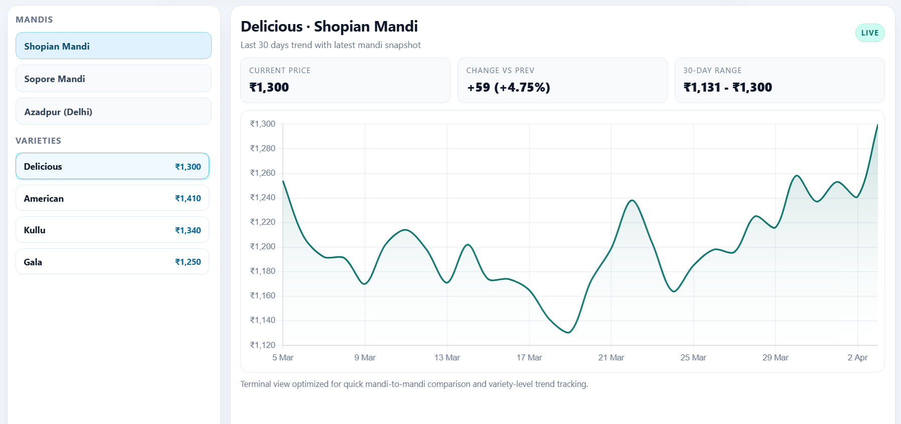

# Kashmir Apple Prices - Real-time Mandi Rates & Insights

A frontend web app for tracking wholesale apple box prices across major mandis, comparing markets, and viewing variety trends in a terminal-style interface.

## Preview





## Features

- Live mandi price cards for Shopian, Sopore, Azadpur, and Vashi.
- Smart bottom toolbar for mandi/variety/price filtering.
- Compare Markets modal for mandi-to-mandi recommendation.
- Variety detail charts with smooth 6-day trend view.
- Dedicated `terminal.html` page with sidebar mandi tabs and variety-level charting.
- Live market news section with refresh support.

## Project files

```txt
index.html      # Main landing page
terminal.html   # Terminal-style market view
variety.html    # Variety detail chart page
style.css       # Global styling
script.js       # UI interactions + data loading
Assets/         # Images, logo, favicon
```

## Quick start

1. Open `index.html` in a browser.
2. Optionally configure API base via:
   - `<meta name="api-base" content="https://your-backend.example.com">`, or
   - `window.__API_BASE__ = "https://your-backend.example.com"`.
3. Use **View Today's Prices** to open terminal view.
