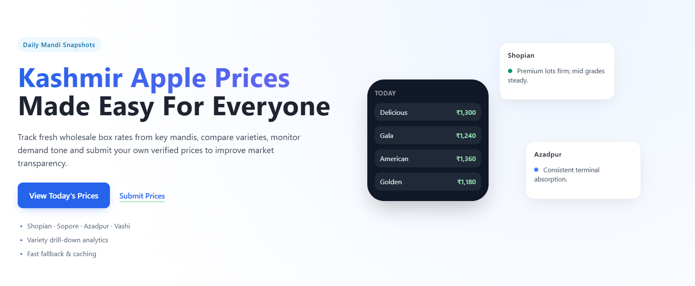
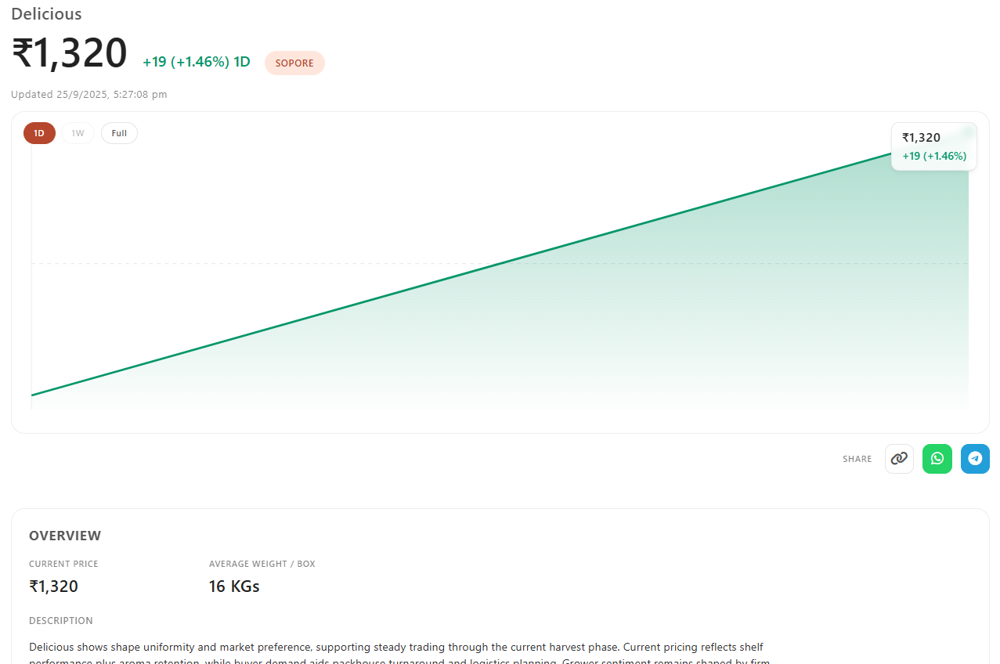

# Kashmir Apple Prices – Real‑time Mandi Rates & Live News

A fast, static web app that fetches real‑time wholesale box prices from key Kashmiri mandis and shows the latest market news. Prices auto‑refresh from an API (with smart fallbacks), and the built‑in news feed fetches fresh stories from the last 7 days.

## Hero



## Variety price charts

Click any price card on the homepage to open a detail page where you can get price charts and compact stats for that variety across the selected mandi.



## What it does (today)

- Live mandi prices for: Shopian, Sopore, Delhi (Azadpur), and Mumbai (Vashi).
- Mock‑first hydration for instant UI, then upgrades to live data when the API responds.
- Robust retries with exponential backoff and timeouts per request.
- Variety drill‑down page (click any price card) with a compact price view and chart.
- Live “Kashmir apples” market news using GNews: rotates multiple queries, de‑duplicates previously seen links, and limits results to the last 7 days; manual Refresh button included.
- Responsive layout, mobile menu with background scroll lock, and an accessible FAQ accordion.
- “Submit Prices” page using an embedded form (Visme).

## How live data works

### Mandi prices

- Frontend calls an endpoint shaped like `/api/prices/:mandi` for `shopian`, `sopore`, `azadpur`, and `mumbai`.
- It first shows lightweight placeholders and/or the static prices in HTML, then attempts a quick "mock=1" request (if supported by your backend) followed by a live request.
- On success, cards are updated; on failure, the initial static values are restored (no hard error state).
- The latest rows per mandi are cached in `sessionStorage` as `mandiRows:<mandi>` for reuse (e.g., the variety page).

Configure the API base URL using one of these (optional):

- Add a meta tag in `index.html` head: `<meta name="api-base" content="https://your-backend.example.com">`
- Or set `window.__API_BASE__ = "https://your-backend.example.com"` before loading `script.js`.

If no backend is available, the page will keep showing the static example prices and remain fully usable.

### Live news (last 7 days)

- Uses GNews search with multiple topic queries (Kashmir apples, mandis, growers, highway updates, horticulture/agriculture).
- De‑duplicates links across refreshes via `sessionStorage` and rotates query themes to surface new stories.
- Shows a compact relative time (e.g., “8 hrs”) and a one‑tap "Read" link.
- Gracefully handles empty or failed searches with a friendly message.

## Files

```
index.html      # Landing page (hero, mandi sections, news, FAQ)
submit.html     # Submit Prices form (embedded)
variety.html    # Variety detail/chart page
style.css       # Styling (responsive, skeletons, FAQ, etc.)
script.js       # Prices + news loaders, retries, nav, FAQ accordion
Assets/
  hero-section.png
  logo-main.png
  favicon.ico
```

## Quick start

1. Open `index.html` in your browser.

2. (Optional) To enable live price updates, point the app to your backend:

   - Add `<meta name="api-base" content="http://localhost:4000">` in the head, or
   - Define `window.__API_BASE__ = "http://localhost:4000"` before `script.js` loads.

3. Click a price card to see the variety detail page.

4. Use the “Refresh” button in the Market updates section to fetch the latest news.

## Notes

- Cards are only clickable when a valid price is present to avoid accidental navigation.
- The mobile menu locks background scroll while open for a smoother UX.
- The FAQ accordion supports one‑open‑at‑a‑time behavior with smooth height animation.
